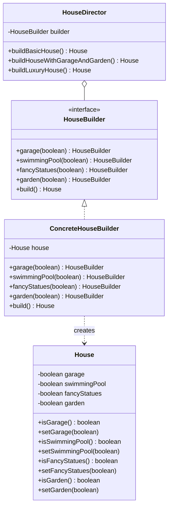
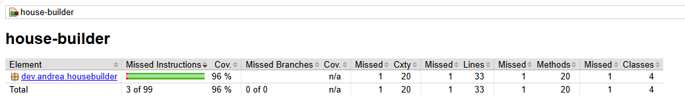

# House Builder

Exercise to practice the Builder design pattern in Java, applied to the `House` entity.

**Author:** Andrea Vázquez ([@AndreaVaGo](https://github.com/AndreaVaGo))

## Description

Starting from the `House` entity, this project implements the Builder design pattern to allow building different types of houses, each representing a specific combination of attributes (garage, garden, swimming pool, fancy statues).

The goal is for the construction process to be flexible, scalable and decoupled, following object-oriented design principles.

## Design Pattern: Builder

The Builder pattern separates the construction of a complex object from its representation, so the same construction process can create different representations of the object.

### Class Diagram



### Roles

| Class | Role | Responsibility |
|---|---|---|
| `House` | Product | Holds the final attributes of the house. Passive object, no construction logic. |
| `HouseBuilder` | Builder (interface) | Declares the chainable construction steps and the `build()` method. |
| `ConcreteHouseBuilder` | Concrete Builder | Implements `HouseBuilder`, assembling a `House` step by step. |
| `HouseDirector` | Director | Knows fixed "recipes" (predefined house types) and orchestrates the builder calls for each one. |

### Predefined house types (Director recipes)

- **`buildBasicHouse()`** — no optional attributes activated.
- **`buildHouseWithGarageAndGarden()`** — garage + garden activated.
- **`buildLuxuryHouse()`** — garage + swimming pool + fancy statues + garden, all activated.

## Usage example

```java
HouseBuilder builder = new ConcreteHouseBuilder();
HouseDirector director = new HouseDirector(builder);

House basicHouse = director.buildBasicHouse();
House cozyHouse = director.buildHouseWithGarageAndGarden();
House luxuryHouse = director.buildLuxuryHouse();

// Custom configuration, without the Director
House customHouse = builder.garage(true).swimmingPool(true).build();
```

## Project structure

```
ex-java-design_patterns-house_builder/
├── src/
│   ├── main/java/dev/andrea/housebuilder/
│   │   ├── House.java
│   │   ├── HouseBuilder.java
│   │   ├── ConcreteHouseBuilder.java
│   │   └── HouseDirector.java
│   └── test/java/dev/andrea/housebuilder/
│       ├── HouseTest.java
│       ├── ConcreteHouseBuilderTest.java
│       └── HouseDirectorTest.java
├── assets/
│   └── test-coverage.png
├── pom.xml
└── README.md
```

## How to run

```bash
mvn compile
mvn test
```

## Test Coverage

Minimum required: **70%**. Current coverage: **96%** (instructions).



## Tech stack

- Java 21
- Maven
- JUnit 5
- Hamcrest
- JaCoCo (coverage)
- Checkstyle